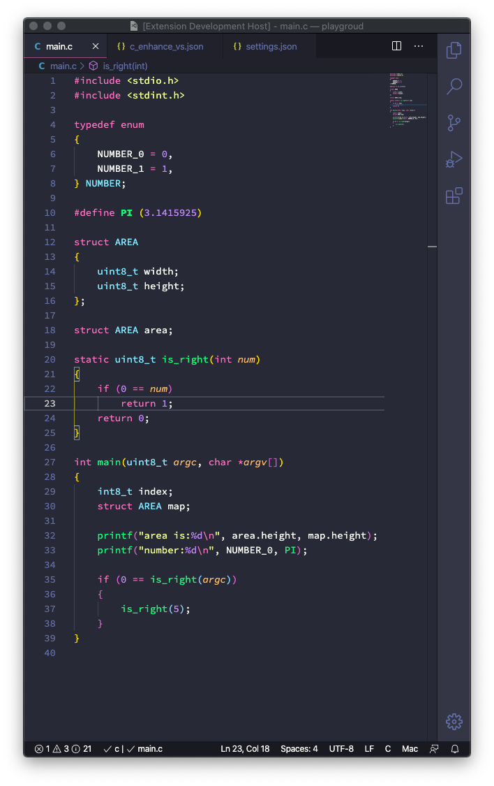
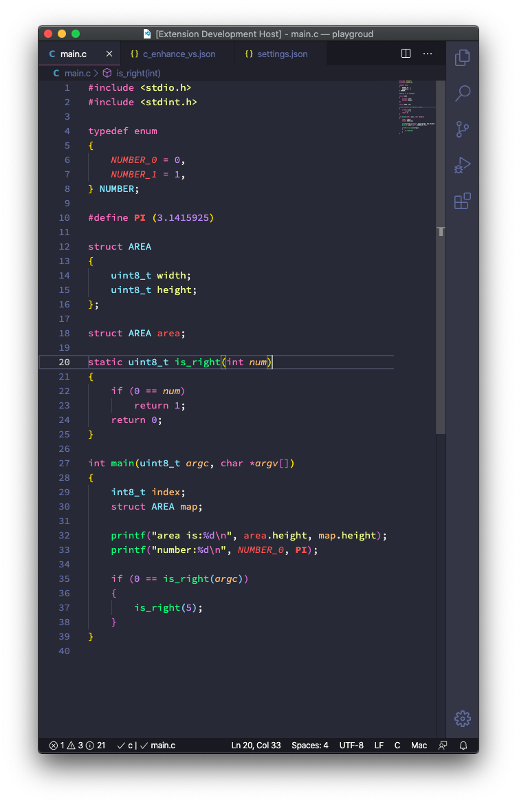

# README

**C Enhanced Theme** is a theme enhanced for language C. It is based on [Dracula Official](https://github.com/dracula/visual-studio-code) theme.

To use the theme, please first install [C/C++](https://github.com/Microsoft/vscode-cpptools) plugin and make sure `C_Cpp.enhancedColorization` enabled.

To get a better C experience on vscode, please refer to [Better C on Vscode](./better-c-on-vscode.md).

Below is C file render comparison of default `Dracula Official Theme` and `C Enhanced Theme`:

Dracula Official

C Enhanced

**Enjoy!**
