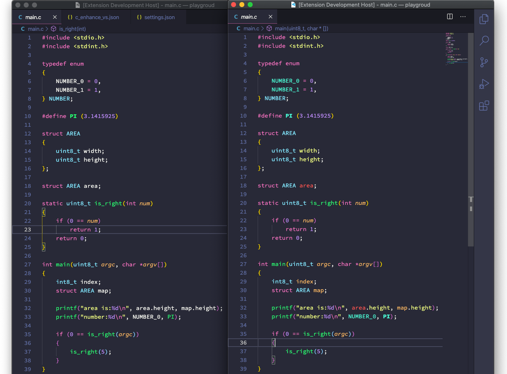

# README

**C Enhanced Theme** is a theme enhanced for language C. It is based on [Dracula Official](https://github.com/dracula/visual-studio-code) theme.

To use the theme, please first install [C/C++](https://github.com/Microsoft/vscode-cpptools) plugin and make sure `C_Cpp.enhancedColorization` enabled.

`C/C++` plugin has a **enhancedColorization** feature which can detect more types of token. The render of there tokens is not supported in vscode default theme framework. Microsoft offered a theme supports these new tokens based on vscode default theme [here](https://marketplace.visualstudio.com/items?itemName=ms-vscode.cpptools-themes). I wrote a new one named `C Enhanced Theme` based on `Dracula Official`.

To get a better C experience on vscode, please refer to [Better C on Vscode](./better-c-on-vscode.md).

Below is C file render comparison of default `Dracula Official Theme` (left) and `C Enhanced Theme` (right):

